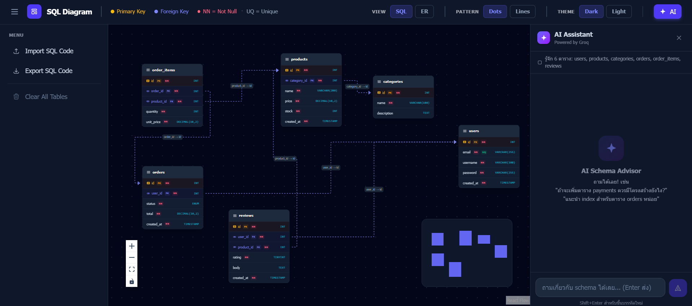
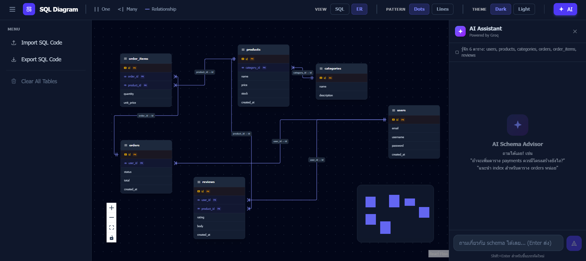

# SQL Generator




A web-based SQL schema diagram editor built with React, TypeScript, and Vite. The application allows developers to visually design, import, and export relational database schemas, with an integrated AI assistant powered by Groq for schema advice and SQL generation.

## Features

### Schema Diagram Editor
- Visual representation of database tables and their relationships
- Interactive drag-and-drop canvas powered by React Flow
- Foreign key relationship lines rendered automatically between tables
- Support for dark and light themes, as well as background pattern options

### Import SQL
- Paste raw `CREATE TABLE` SQL statements to generate a diagram
- Upload a `.sql` file directly from your file system
- Supports primary keys, foreign keys, constraints, and common column types

### Export SQL
- View the generated `CREATE TABLE` SQL code for the current schema
- Copy SQL to clipboard
- Download as a `.sql` file

### Clear Diagram
- Remove all tables from the current diagram with a single action

### AI Assistant (Groq)
- Right-side chat panel powered by the Groq API (LLaMA 3.3 70B)
- AI is aware of the current schema context (table names, columns, keys)
- Provides recommendations for new table structures and SQL code
- Inline SQL code blocks with a confirm button to apply suggested SQL directly into the diagram

## Technology Stack

| Layer | Technology |
|---|---|
| Framework | React 19, TypeScript |
| Build Tool | Vite |
| Styling | Tailwind CSS v4 |
| Diagram | @xyflow/react (React Flow) |
| AI | Groq SDK (LLaMA 3.3 70B) |

## Getting Started

### Prerequisites

- Node.js 18 or higher
- A Groq API key — obtain one at [console.groq.com](https://console.groq.com)

### Installation

```bash
npm install
```

### Environment Configuration

Copy the example environment file and fill in your Groq API key:

```bash
cp .env.example .env
```

Edit `.env`:

```
VITE_GROQ_API_KEY=your_groq_api_key_here
```

### Development Server

```bash
npm run dev
```

The application will be available at `http://localhost:5173`.

### Production Build

```bash
npm run build
```

## Project Structure

```
src/
  components/        # UI components (Sidebar, AppHeader, modals, diagram node)
  utils/             # SQL parser, SQL exporter, Groq client
  types/             # TypeScript interfaces for schema and theme
  data/              # Default sample schema
```

## Notes

- The Groq API key is loaded from the `VITE_GROQ_API_KEY` environment variable. Do not commit the `.env` file to version control.
- The AI assistant sends the full schema context (table names and column definitions) as part of every request to Groq.
